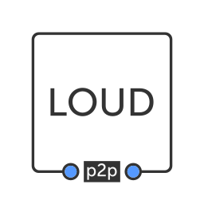

# loudp2p

loudp2p is an experimental peer to peer network for music streaming. The idea comes after a few personal experiments with browser-based Bittorrent streaming, see [ng-chunked-audio](https://github.com/matiasinsaurralde/ng-chunked-audio). The rest was mostly based on [torrent-stream](https://github.com/mafintosh/torrent-stream).

## Protocol design

My current plan is to use [Protocol Buffers](https://developers.google.com/protocol-buffers/) to describe the network messages. This makes it easier to generate bindings for other languages, enabling the community to write their own clients in a standard way.

These messages will be exchanged using [gRPC](http://www.grpc.io/) over [HTTP2](https://en.wikipedia.org/wiki/HTTP/2). These will involve standard data structures for peer discovery (announcements), search (index lookup) and stream initiation (*Peer A would like to stream file X from Peer B and Peer C, etc.*).

The data streams will use dedicated UDP sockets, on random ports, just like other P2P applications do. If UDP sockets aren't available, an alternative approach could wrap the data chunks as Protocol Buffer messages and send them over gRPC/HTTP2. Think about browser streaming.

A network peer will have a hybrid role most of time, e.g participating as a server and a client at the same time. See the section about peer roles.

A network peer will use an [ECDSA](https://en.wikipedia.org/wiki/Elliptic_Curve_Digital_Signature_Algorithm) key to sign all sent messages.

Peer IDs will be used instead of IP addresses most of the time. Key generation will take place during the bootstrap procedure and a peer ID will be derived from the public key. In a way, this process resembles the logic behind [Bitcoin address generation](https://en.bitcoin.it/wiki/Technical_background_of_version_1_Bitcoin_addresses). 

Peer IDs will be useful for tracking peers when IP or network changes occur. 

## Bootstrapping

An initial list of peers will be used for bootstrapping. Peer discovery strategies need more investigation.

Peer discovery should be implemented in a way that guarantees the unstructured operation of the network.

## Peer/cooperation roles

A peer that participates as a "server" will reply general queries and stream requests if the data is available locally. It should also receive and handle announcement messages from other peers, and keep a track of them during its lifetime.

A peer may assume different cooperation roles during its operation, making it easier for the network to scale or recover from failure.

## Light clients

In the blockchain world, a light client represents a network client that doesn't need a copy of the whole blockchain to participate. In the context of this project, think about a mobile phone with a 3G connection, running a minimal client with support for peer discovery and streams.

## Licensing

[MIT](LICENSE.md)
